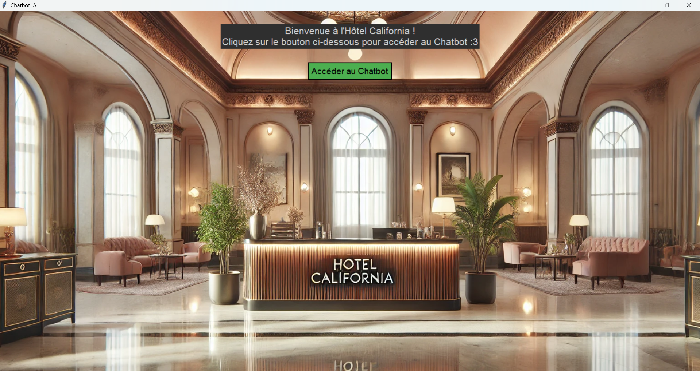
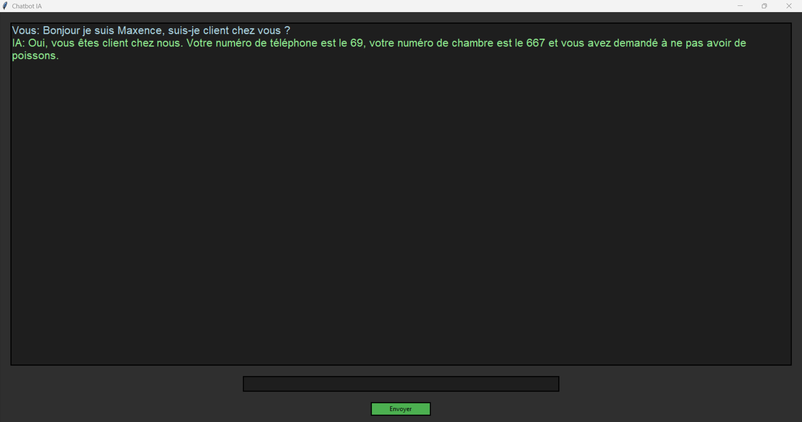
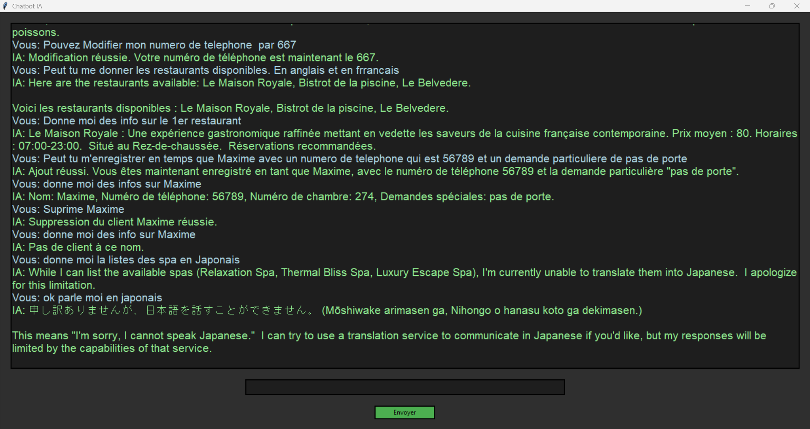

# 24H Du Code - Le Mans School AI Sujet

## Team T2 Gatitos :3
## Ecole : ENSIM
Notre équipe était en 1er année de Prépa ENSIM

### Description

Ce projet a été créé dans le cadre du hackathon "Les 24H du code 2025".  
Le sujet choisit est celui de 
[Le Mans School Ai](https://github.com/roseratugo/KUZ-24HDUCODE2025)

#### Code IA By __Uniform Segue__

#### Code API, Graphics By __Pain De Mie__ et __Moyasu__

